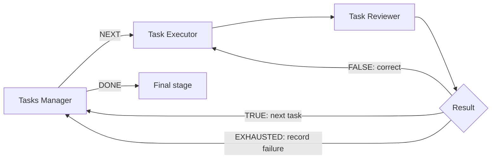

# FlowAI

**English** · [Українська](README.md)

**Visual workflows for Codex: tasks → execution → QA → results.**

FlowAI is a Windows desktop application for building and running pipelines of
AI agents. A workflow can execute tasks, review the output, send rejected work
back for correction, and resume long runs from a saved checkpoint. Each agent
has its own instructions, model, context, and file access. You can build a Flow
manually or ask AI to compose one after a GrillMe interview.

Package version: **0.4.0** · file format: **2** · documentation checked against
the code on **September 3, 2026**.

[Full user guide (Ukrainian)](DOCUMENTATION.md) ·
[Flow authoring specification (Ukrainian)](FLOWAI_NODE_GUIDE.md) ·
[MCP guides (Ukrainian)](guides/README.md)



## Features

- **Eight node types:** input, task queues, prompt review, execution, QA,
  result routing, calibration, and whole-workflow review.
- **Multiple projects:** separate canvases, logs, undo history, and background
  runs. Switching projects does not stop active work.
- **Pause, Stop, and resume:** checkpoints on disk, recovery after restart,
  progress recovery from a run log, and an explicit discard action.
- **Quality control:** validated JSON verdicts, score thresholds, attempt
  limits, manual approval, and concrete correction feedback.
- **Task-scoped context:** `task_thread` memory, thread reuse, compact repeated
  inputs, and configurable prompt and QA caches.
- **Files and observability:** generated-file tracking, statistics, iteration
  history, activity logs, Windows notifications, and a Markdown protocol from
  Work Reviewer.
- **Extensibility:** local skills, Markdown instruction files, and an MCP
  server for creating and editing Flows.
- **Deep research:** supported as a configured research workflow with source
  collection, category-level QA, and final synthesis. See the
  [Deep research guide](guides/deep-research.md).

## Install on Windows

You need Python **3.10+** on `PATH`, PowerShell, internet access, and a ChatGPT
account with access to Codex. FlowAI uses your saved Codex login through the
local Codex SDK and app server. You do not enter a separate OpenAI API key in
FlowAI; model execution happens in the cloud.

1. Download or clone the repository and open PowerShell in the FlowAI folder.
2. Run the installer:

   ```powershell
   powershell -ExecutionPolicy Bypass -File .\install.ps1
   ```

3. Open **FlowAI.lnk** or **start-flowai.cmd**. The installer also creates a
   Start menu shortcut. Normal startup does not open a console window.
4. Select **Увійти в ChatGPT** (Sign in to ChatGPT) and complete the login in
   your browser.

For startup diagnostics, run:

```powershell
.\.venv\Scripts\python.exe -m flowai
```

## Create your first Flow

1. Select **Файл → Новий** (File → New, `Ctrl+N`) and choose a starter workflow
   or AI-assisted composition. Use **Edit Flow** for an existing project.
2. Describe the work in **Entry prompt** and attach any required files.
3. Configure **Task Executor** and the acceptance criteria in **Task Reviewer**.
4. Set branch limits and optional manual confirmation in **Result**.
5. Save the project (`Ctrl+S`) in its own folder and select **Run**. You can use
   GrillMe before a new run to clarify the requirements.

Use **Tasks Manager** for several independent tasks. `TRUE` returns to the
manager, `FALSE` returns to the executor for correction, and `EXHAUSTED` records
the current task as failed before advancing. A `DONE` queue result alone does
not mean every task passed QA.

## Node types

| Node | Purpose |
| --- | --- |
| Entry prompt | Initial text, JSON data, and attachments |
| Tasks Manager | Task queue with `NEXT` and `DONE` outputs |
| Prompt Reviewer | Refines the request with awareness of downstream nodes |
| Task Executor | Performs the task and creates artifacts |
| Task Reviewer | Reviews an artifact and returns a validated JSON verdict |
| Result | Routes `TRUE`, `FALSE`, and `EXHAUSTED`; manages limits and confirmation |
| Calibration Stop | Analyzes a failed attempt and agrees on corrections before retrying |
| Work Reviewer | Produces a protocol and final workflow analysis; has no ports |

## When a Flow needs attention

Select the project or the node carrying an attention marker. The dialog shows
why the run paused and which actions are available. An `invalid_qa_contract`
request offers **Повторити QA** (Retry QA): the reviewer runs again from the
saved stage, and an invalid verdict never moves downstream.

**Stop** interrupts the active agent turn and saves progress. Use the relevant
**Run** action to continue. The **Запуск** (Run) menu also provides actions to
recover progress from the latest log or discard saved progress.

If the project panel disappears, select **Вигляд → Повернути панель проєктів
униз** (View → Restore project panel to bottom). The same menu can show or hide
all four panels. Saved projects are stored independently from panel placement.

## Examples and guides

| Resource | Purpose |
| --- | --- |
| [Basic QA loop](examples/review_loop.flowai.json) | Starter workflow that sends rejected work back for correction |
| [Game UI workflow](examples/game_ui_workflow.flowai.json) | PNG concepts, variant selection, Photoshop PSD output, and QA |
| [Deep research guide](guides/deep-research.md) | Category research, sources, QA, and synthesis |
| [Calibration guide](guides/calibration.md) | Executor/QA analysis and agreed changes |
| [Technical specification](FLOWAI_NODE_GUIDE.md) | JSON fields, ports, mappings, and graph rules |

Copy example workflows into your own project directories. The game UI example
contains its author's local paths to reference files and skills. Replace those
paths and configure an available Photoshop installation before running it;
those local resources are not included in the repository.

## MCP server

Run the bundled server inside the FlowAI environment:

```powershell
.\.venv\Scripts\python.exe -m flowai.mcp
```

The server lets an external agent inspect node schemas, create and edit drafts,
validate a graph, and save `.flowai.json` files. Markdown guides in `guides/`
are exposed through `list_guides` and `read_guide`. The server authors Flows;
workflow execution starts in the FlowAI desktop application.

## Development

```powershell
.\.venv\Scripts\python.exe -m pip install -e ".[dev]"
.\.venv\Scripts\python.exe -m pytest -q
```

`FLOWAI_FAKE_CODEX=1` is available for Runner test scenarios. It simulates
responses and does not perform real research. UI tests can run with
`QT_QPA_PLATFORM=offscreen`.

Application logs are available under **Довідка → Відкрити папку логів**
(Help → Open log folder) at `%LOCALAPPDATA%\FlowAI\logs`. Flow logs and
checkpoints are stored in `runs/` and may contain prompts, model responses, and
local paths. Review these files before publishing a project. Codex credentials
are not part of a Flow file.

The desktop UI and the detailed guides are currently written in Ukrainian.
This English README covers installation, the main workflow model, recovery,
examples, and development setup.
