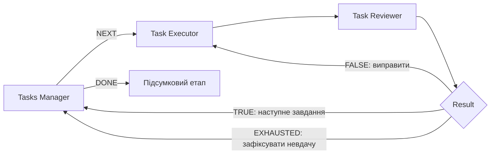

# FlowAI

**Візуальні Workflow для Codex: завдання → виконання → QA → результат.**

FlowAI — настільна програма для Windows, у якій можна збирати й запускати
ланцюжки AI-агентів, повертати роботу на доопрацювання та продовжувати довгі
запуски зі збереженого стану. Кожен агент має власні інструкції, модель,
контекст і доступ до файлів. Flow створюється вручну або через AI з GrillMe.

Версія пакета: **0.4.0** · формат файлів: **2** · документацію звірено з кодом
**3 вересня 2026 року**.

[Посібник користувача](DOCUMENTATION.md) ·
[Специфікація для складання Flow](FLOWAI_NODE_GUIDE.md) ·
[Довідники MCP](guides/README.md)



## Можливості

- **Вісім типів блоків:** постановка задачі, черга завдань, уточнення промпту,
  виконання, QA, приймання результату, калібрація й аналіз усього Flow.
- **Кілька проєктів:** окремі полотна, журнали, історія редагування та фонові
  запуски; перемикання між проєктами не зупиняє роботу.
- **Pause, Stop і продовження:** checkpoint на диску, відновлення після
  перезапуску, відновлення прогресу з журналу та окрема команда його відкидання.
- **Контроль якості:** перевірка JSON-вердикту, поріг оцінки, ліміти спроб,
  ручне підтвердження та конкретні зауваження для доопрацювання.
- **Контекст за завданням:** режим `task_thread`, повторне використання тредів,
  скорочення повторюваних входів і налаштовувані кеші.
- **Файли й спостереження:** Files, Stats, історія проходів, журнал активності,
  Windows-сповіщення та Markdown-протокол Work Reviewer.
- **Розширення:** локальні skills, MD-інструкції, власний MCP-сервер;
  [Deep research як налаштований дослідницький Flow](guides/deep-research.md).

## Встановлення на Windows

Потрібні Python **3.10+** у `PATH`, PowerShell, інтернет і профіль ChatGPT із
доступом до Codex. FlowAI використовує вхід через Codex SDK; власний OpenAI
API-ключ у налаштуваннях програми не потрібен. Моделі працюють у хмарі.

1. Завантажте репозиторій і відкрийте PowerShell у папці FlowAI.
2. Запустіть інсталятор:

   ```powershell
   powershell -ExecutionPolicy Bypass -File .\install.ps1
   ```

3. Відкрийте **FlowAI.lnk** або **start-flowai.cmd**. Інсталятор також створює
   ярлик у меню «Пуск»; звичайний запуск не відкриває консоль.
4. Натисніть **Увійти в ChatGPT** і завершіть вхід у браузері.

Для діагностики запуску використовуйте:

```powershell
.\.venv\Scripts\python.exe -m flowai
```

## Перший Flow

1. Виберіть **Файл → Новий** (`Ctrl+N`) і готову стартову схему або складання
   з AI. Для наявного проєкту доступна кнопка **Edit Flow**.
2. Опишіть завдання в **Entry prompt**, додайте потрібні файли.
3. Налаштуйте **Task Executor** і критерії **Task Reviewer** у **Parameters**.
4. У **Result** задайте ліміти та, за потреби, ручне підтвердження.
5. Збережіть проєкт (`Ctrl+S`) у власну папку й натисніть **Run**. Перед новим
   запуском можна пройти уточнення через **GrillMe**.

Для кількох незалежних завдань використовуйте **Tasks Manager**. `TRUE`
повертається до менеджера, `FALSE` — до виконавця; `EXHAUSTED` дозволяє перейти
до наступного завдання, зафіксувавши невдачу поточного. Завершення черги через
`DONE` саме по собі не означає, що всі завдання пройшли QA.

## Блоки

| Блок | Призначення |
| --- | --- |
| Entry prompt | Початковий текст, JSON і вкладення |
| Tasks Manager | Черга завдань, виходи `NEXT` та `DONE` |
| Prompt Reviewer | Уточнення постановки задачі з урахуванням подальшого маршруту |
| Task Executor | Виконання задачі та створення артефактів |
| Task Reviewer | Перевірка результату й узгоджений JSON-вердикт |
| Result | `TRUE`, `FALSE`, `EXHAUSTED`, ліміти й підтвердження |
| Calibration Stop | Аналіз невдалої спроби та погодження правок перед повтором |
| Work Reviewer | Протокол і підсумковий аналіз; блок без портів |

## Якщо Flow очікує дії

Виберіть проєкт або натисніть блок зі знаком уваги. Вікно покаже причину паузи
та доступні дії. Для `invalid_qa_contract` доступна **Повторити QA**: перевірка
повториться зі збереженого етапу. Некоректний вердикт не передається далі.

Кнопка **Stop** перериває активний хід і зберігає прогрес. Для продовження
виберіть відповідну дію **Run**. У меню **Запуск** також доступні
**Відновити прогрес з останнього журналу** та **Відкинути збережений прогрес**.
Особливості окремих діалогів описані в
[посібнику](DOCUMENTATION.md#пауза-зупинка-та-відновлення).

Якщо зникла панель проєктів: **Вигляд → Повернути панель проєктів униз**.
У цьому ж меню можна показувати й приховувати всі чотири панелі. Список
доданих проєктів зберігається окремо від розташування панелей.

## Приклади та довідники

| Матеріал | Для чого |
| --- | --- |
| [Базовий цикл QA](examples/review_loop.flowai.json) | Стартова схема з поверненням на доопрацювання |
| [Ігровий UI](examples/game_ui_workflow.flowai.json) | Концепти PNG, вибір варіантів, Photoshop PSD і QA |
| [Deep research](guides/deep-research.md) | Дослідження за категоріями, джерела, QA та підсумок |
| [Калібрація](guides/calibration.md) | Аналіз Executor/QA і погодження змін |
| [Технічна специфікація](FLOWAI_NODE_GUIDE.md) | Поля JSON, порти, мапінги й правила графа |

Приклади копіюйте у власні проєктні папки. UI-шаблон містить локальні шляхи
автора до референсів і skills: перед запуском замініть їх та налаштуйте
наявний Photoshop. Ці ресурси не постачаються разом із шаблоном.

## MCP

Сервер запускається командою `python -m flowai.mcp` у середовищі FlowAI.
Він дозволяє зовнішньому агенту читати схему блоків, створювати й редагувати
чернетки, перевіряти граф і зберігати `.flowai.json`. Markdown-довідники з
`guides/` доступні через `list_guides` та `read_guide`.

Налаштування запуску сервера й приклад конфігурації — у
[документації MCP](DOCUMENTATION.md#mcp-сервер).

## Розробка

```powershell
.\.venv\Scripts\python.exe -m pip install -e ".[dev]"
.\.venv\Scripts\python.exe -m pytest -q
```

Для тестових сценаріїв Runner є `FLOWAI_FAKE_CODEX=1`; це імітація відповідей,
яка не виконує справжнє дослідження. UI-тести можуть працювати з
`QT_QPA_PLATFORM=offscreen`.

Журнали програми: **Довідка → Відкрити папку логів**
(`%LOCALAPPDATA%\FlowAI\logs`). Журнали Flow і checkpoint лежать у `runs/`
й можуть містити промпти та відповіді. Публікуючи проєкт, перевірте ці файли
та локальні шляхи; облікові дані Codex не належать до файлів Flow.

[Поточні обмеження](DOCUMENTATION.md#поточні-обмеження) ·
[Архів технічних планів](docs/README.md)
